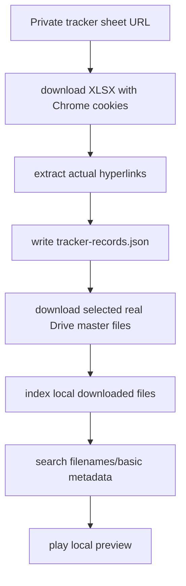

# Rippopotamus Media Library Blueprint

Status: active local-library contract

## Plain Goal

Build a local media library that indexes real files from real sources and never pretends filename matches are visual understanding.

The active first slice is deliberately boring:

```text
real source sheet -> real Drive download -> local file -> app-level library DB -> filename/basic metadata search -> playable preview
```

Visual scene search is a known gap. Searches like `women`, `mic`, `stage`, or `crowd` should not be implied to work until a proper caption/tag/transcript layer exists.

## Active Repo Truth

| Layer | Current files | What exists now |
| --- | --- | --- |
| Tracker sheet intake | `scripts/import-tracker-sheet.py` | Downloads the private Google Sheet through Chrome cookies as XLSX, preserves real hyperlinks, writes a row manifest, and can download/index real master videos. |
| Google Drive download | `src/rippopotamus/google_drive.py` | Downloads Drive files with browser cookies and handles the virus-scan warning form including hidden confirm params. |
| SQLite index | `src/rippopotamus/footage_index.py` | Creates `.rippo/index.sqlite3`, `assets`, `moments`, optional FTS5 table, lexical search, status/counts. |
| Desktop index root | `electron/appPaths.ts`, `electron/indexIpc.ts` | Desktop search uses one app-managed library DB under Electron `userData`; selected folders are scan paths, not separate library identities. |
| Electron media serving | `electron/libraryIpc.ts`, `electron/mediaLibrary.ts` | Returns thumbnails and playable media URLs for local files. |
| UI hook | `src/desktop/app/useLibraryIndex.ts` | Calls filename/basic metadata ingest and search, manages status/errors/thumbs/expanded preview state. |
| UI rendering | `src/desktop/App.tsx` | Renders saved-file result cards, thumbnails, previews, reveal button, and honest empty states. |

## Active Data Model

### Asset

One physical file on disk.

Current table: `assets`

| Field | Meaning |
| --- | --- |
| `id` | Stable local id derived from resolved file path. |
| `path` | Absolute local file path. |
| `root` | App-managed library index root. |
| `kind` | `video`, `image`, `audio`, or fallback. |
| `title` | Clean title from filename. |
| `size`, `mtime` | Change detection. |
| `duration`, `width`, `height` | Media metadata from ffprobe where available. |
| `indexed_at` | Last asset index timestamp. |

### Moment

For the active slice, a moment is only the default full-file searchable row created from filename/path/media metadata.

Current table: `moments`

| Field | Meaning |
| --- | --- |
| `id` | Default full-file moment id, usually `<asset_id>:full`. |
| `asset_id` | Parent asset. |
| `path` | Local file path for playback/reveal. |
| `start`, `end` | Full file range. |
| `title` | Display title derived from filename. |
| `description` | Searchable filename/path/media metadata. |
| `tags_json` | Basic tags like kind, extension, parent folder. |
| `embedding_json` | Not used in the active desktop library. |
| `embedding_provider`, `embedding_model`, `embedding_dim` | Not used in the active desktop library. |
| `updated_at` | Last moment write timestamp. |

## Ingestion Contract

### Inputs

```text
index root: app-managed library DB under Electron userData
paths: real downloaded files or selected folders
```

The desktop UI must not use the saved folder as the DB identity. The selected folder is only a scan path.

### Output

```text
.rippo/index.sqlite3 exists under the app-managed library index root
assets has one row per discovered media file
moments has one default full-file row per asset
embeddedMomentCount stays 0
failures are explicit
```

### Tracker Sheet Flow



## Search Contract

Search returns playable file cards. It is filename/basic metadata search only.

Required result shape:

| Field | Meaning |
| --- | --- |
| `id` | Moment id. |
| `assetId` | Parent asset id. |
| `path` | Absolute file path for thumbnail/media URL. |
| `file` | Display-safe filename/path label. |
| `kind` | Media kind used for icon/player. |
| `title` | Card title. |
| `description` | Filename/path/media metadata snippet. |
| `tags` | Basic tag list. |
| `start`, `end` | Playback range. |
| `score` | Lexical score if available. |
| `matchType` | Active desktop library should be `text` or `recent`, not `embedding`. |

No fake fallback results. No fake semantic labels. No sample files pretending to be real footage.

## Known Gap

The missing product layer is real scene understanding:

```text
video/audio -> chunk -> caption/tags/transcript -> searchable moment rows -> preview at timestamp
```

That future layer should produce inspectable text like:

```json
{
  "start": 75,
  "end": 105,
  "caption": "A woman speaks into a handheld microphone at a public event.",
  "objects": ["microphone", "chairs"],
  "people": ["woman speaker", "audience"],
  "setting": "public gathering"
}
```

Only after that exists should searches like `women`, `mic`, `crowd`, or `stage` be treated as real scene search.

## Verification Contract

Clean active-library checks:

```bash
PYTHONPATH=src python scripts/import-tracker-sheet.py \
  'https://docs.google.com/spreadsheets/d/1DogfVrUl_gk5AeHJt3ISKI6OCE0PPy5kj6lrMmMUSbc/edit?gid=0#gid=0' \
  --require-master --limit 1 --download-master

PYTHONPATH=src python -m rippopotamus.desktop_engine index-status \
  --index-root "$HOME/Library/Application Support/rippopotamus/library-index"

PYTHONPATH=src python -m rippopotamus.desktop_engine index-search \
  --index-root "$HOME/Library/Application Support/rippopotamus/library-index" \
  --query "Rohtak Modi" --limit 5
```

Expected today:

```text
Rohtak Modi -> real downloaded Rohtak master video
women -> 0, until scene-understanding layer is rebuilt
mic -> 0, until scene-understanding layer is rebuilt
embeddedMomentCount -> 0
```

## Not Now

- Direct video embeddings as product search.
- Generic chunk rows that only say `video moment 00:00 to 00:30`.
- Fake demo filenames.
- Cloud sync.
- Multi-user rights management.
- Manual tagging UI.
