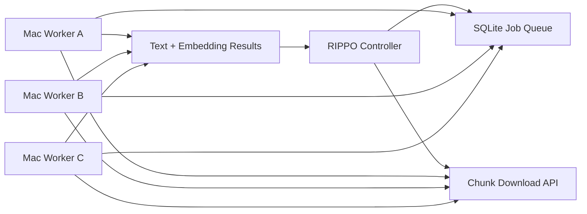

# Semantic Indexing for Editor Search

This document uses the Diátaxis structure:

- Tutorial: first useful indexing run
- How-to: concrete tasks and operating choices
- Explanation: why RIPPO should not default to direct video embeddings
- Reference: costs, presets, lanes, and data contracts

## Tutorial: Index a Footage Folder for Editor Search

Goal: make a company footage folder searchable from a single search bar.

The editor should be able to search phrases like:

- `minister waving from car`
- `wide shot stage`
- `crowd waving flags`
- `woman speaking at podium`
- `night rally`
- `logo visible on banner`
- `drone shot traffic`

The result should be a moment, not just a file:

```text
00:12:35 - 00:12:52
Crowd waving flags near a lit stage at night.
[thumbnail strip]
Reveal / Copy path / Export clip
```

### Recommended First Run

Use **Balanced**.

Balanced should create:

1. Asset metadata from file names, folders, dates, duration, and resolution.
2. Scene or chunk records.
3. Audio transcript when audio exists.
4. Compact visual narration for each scene or chunk.
5. Visible-text labels when possible.
6. Text embeddings and full-text search over generated text.

Expected Gemini Flash-Lite cost: about `₹20-₹35/hr` of footage.

Do not use direct video embeddings for the first run. That mode is for selected folders or clips after the normal index fails to find something.

## How-To

### Choose a Scan Mode

Use **Basic scan** when:

- the folder is huge
- you only need file names, folders, dates, and existing metadata
- you want a near-free first pass

Use **Balanced** when:

- editors need normal search across company footage
- speech, events, crowds, locations, and visible actions matter
- you want the default production mode

Use **Detail search** when:

- a project is important
- small objects, signs, people, and dense visual detail matter
- higher narration cost is acceptable

Use **Deep video scan** when:

- visual similarity matters
- the user asks for hard-to-describe visual matches
- the folder or clip is selected intentionally
- the cost preview is accepted

### Estimate Cost Before Ingest

Before indexing starts, show:

```text
This folder has ~4.2 hours of footage.
Balanced estimate: ~₹126.
Deep video estimate: ~₹6,700.
```

The UI should require an explicit confirmation for Deep video scan.

Required controls:

- Max spend cap
- Max duration cap
- Pause and resume
- Per-folder scan mode
- Local/cloud selector
- No surprise background deep video scan

### Use Plain UI Names

Use editor-facing names:

- `Quick scan`
- `Balanced`
- `Detail search`
- `Deep video scan`
- `Estimated cost`
- `Search precision`
- `Picture detail`
- `Motion detail`

Avoid implementation names in the main settings:

- `chunk duration`
- `target FPS`
- `embedding provider`
- `vector lane`
- `GEMINI_API_KEY`

Provider state belongs in diagnostics or advanced settings, not the main ingest settings.

### Add Local Workers Later

If multiple Apple Silicon Macs are available, use them as LAN workers.

First version:

1. Controller creates jobs.
2. Workers poll for jobs.
3. Controller sends chunk bytes or temporary chunk URLs.
4. Workers return transcript, narration, keyframe labels, or embeddings.
5. Controller writes results into the index.

Avoid shared-path dependency in v1. Paths like `/Users/dev/Downloads/...` will not exist on every Mac.

## Explanation

### Why Direct Video Embeddings Are Not the Default

Direct video embeddings are not wrong. They are wrong as the default indexing layer for editor search.

Reasons:

1. Cost is high because video embeddings are priced per frame.
2. Results are opaque; editors need labels and summaries.
3. Filtering is better with text fields: transcript, people, place, action, visible text.
4. Generated text is easier to debug and regenerate.
5. Most editor searches are descriptive, not pure visual-similarity searches.

The better default is:

```text
video -> scenes/chunks -> narration/transcript/OCR/tags -> text search + text embeddings
```

Direct video embeddings remain useful for:

- visual similarity search
- "find shots like this"
- hard-to-describe visual style
- selected archive-quality deep indexing

### Why Multimodal Still Matters

Multimodal models are still useful. RIPPO should use them to generate searchable text first.

Good default:

```text
Gemini Flash-Lite watches/listens to a scene
-> emits compact searchable text
-> RIPPO indexes that text
```

This gives the editor readable evidence:

```text
Matched because: "night crowd waving flags near a stage"
```

That is better than returning a hidden vector match with no explanation.

### Why Embedding Lanes Must Stay Separate

Embedding vectors from different model families are not directly comparable.

Correct:

```text
Gemini query embedding -> Gemini vectors only
Qwen query embedding   -> Qwen vectors only
SigLIP query embedding -> SigLIP vectors only
Text query embedding   -> matching text embedding model only
```

Wrong:

```text
Gemini query embedding -> Qwen vectors
Qwen query embedding   -> Gemini vectors
```

Same dimension does not mean same vector space.

Search should:

1. Detect available lanes.
2. Embed the query once per lane.
3. Search each lane separately.
4. Merge ranked results at the result layer.

Do not merge raw vectors across providers.

## Reference

### Cloud Cost Reference

Approx INR uses `1 USD ~= ₹94`.

Gemini Embedding 2 pricing:

| Input | Paid tier |
|---|---:|
| Text | `$0.20 / 1M tokens` |
| Image | `$0.45 / 1M tokens`, about `$0.00012 / image` |
| Audio | `$6.50 / 1M tokens`, about `$0.00016 / second` |
| Video | `$12.00 / 1M tokens`, about `$0.00079 / frame` |

Gemini Flash / Flash-Lite narration is much cheaper than direct video embeddings because video understanding is token-priced by seconds, while video embeddings are frame-priced.

Approx cost per hour:

| Mode | Expected use | Rough cost |
|---|---|---:|
| Quick narration scan | rough scene labels and transcript | `~₹10-₹15/hr` |
| Balanced narration scan | useful scene labels, transcript, visible text | `~₹20-₹35/hr` |
| Detail narration scan | richer people/action/object descriptions | `~₹45-₹80/hr` |
| Direct video embeddings | frame-level deep visual retrieval | `~₹850-₹5,000/hr` |

### Preset Reference

#### Basic Scan

Near-free first pass.

Indexes:

- File names
- Folder names
- Metadata
- Existing subtitles
- Existing sidecar text

#### Balanced

Default for normal company footage.

Indexes:

- 30-60 second scene chunks
- Audio transcript
- Compact visual narration
- Visible text extraction where possible
- Text embeddings over generated text

Expected cost: around `₹30/hr` of footage with Gemini Flash-Lite style narration.

#### Detail Search

For important projects.

Indexes:

- Shorter chunks
- Richer descriptions
- More keyframes
- Better small-object, text, face, and action coverage

Expected cost: around `₹50-₹80/hr`, depending on output size and chunking.

#### Deep Video Scan

For selected folders or clips only.

Indexes:

- Direct video embeddings
- Visual similarity signals
- Hard-to-describe shot matches

Expected cost: expensive. Treat this as an intentional paid action.

### Local Mode Reference

Recommended local stack:

- Qwen3-VL-Embedding-2B for local multimodal retrieval
- SigLIP / CLIP for fast keyframe/image search
- Whisper for local audio transcript
- Local text embeddings for captions, transcripts, metadata

On an Apple M1 Max Mac Studio with 32 GB unified memory, Qwen3-VL-Embedding-2B is realistic as a background worker. Qwen 8B-class models are experiments, not the default.

### Worker Pool Reference



First version:

- Controller owns source files.
- Workers receive chunk bytes or temporary URLs.
- Workers return JSON.
- Controller writes into the SQLite index.

No Kubernetes. No Redis. Start with local HTTP plus SQLite queue.

### Storage Contract

Every searchable moment should support:

```text
asset_id
path
start
end
title
transcript
narration
visible_text
tags_json
provider
model
embedding_dim
embedding_json
source_kind
```

The index can store multiple lanes for the same moment:

```text
moment A
  text embedding lane
  qwen visual lane
  gemini deep video lane
```

Search merges results, not vector spaces.

## Sources

- Gemini API pricing: https://ai.google.dev/gemini-api/docs/pricing
- Gemini token counting: https://ai.google.dev/gemini-api/docs/tokens
- Gemini Embedding 2: https://ai.google.dev/gemini-api/docs/embeddings
- Qwen3-VL-Embedding: https://github.com/QwenLM/Qwen3-VL-Embedding
