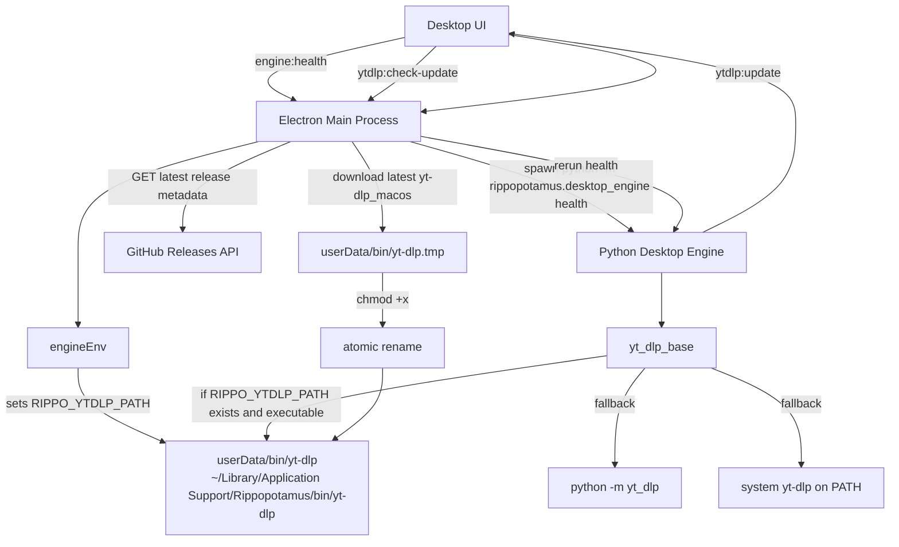

# yt-dlp Binary Updater LLD

## Boundaries

- Electron owns update download, file writes, chmod, and atomic replacement.
- Python owns media execution only: resolve `yt-dlp`, run health, fetch, and download.
- The app never updates system Python or system `yt-dlp`.

## Update Flow

1. UI asks for `engine:health`.
2. Electron sets `RIPPO_YTDLP_PATH` to `userData/bin/yt-dlp`.
3. Python engine prefers that executable if present.
4. If missing, Python falls back to `python -m yt_dlp` or system `yt-dlp`.
5. UI asks `ytdlp:check-update`.
6. Electron compares current version against GitHub latest release.
7. User clicks update.
8. Electron downloads the new binary to a temp path.
9. Electron runs `chmod +x`.
10. Electron atomically replaces `userData/bin/yt-dlp`.
11. Electron reruns health and returns the new version.
